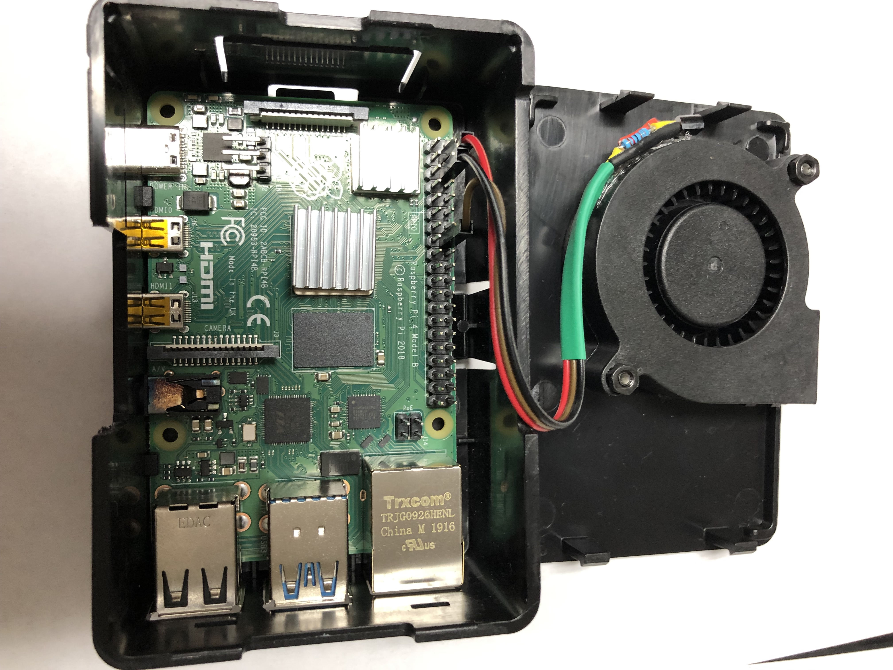
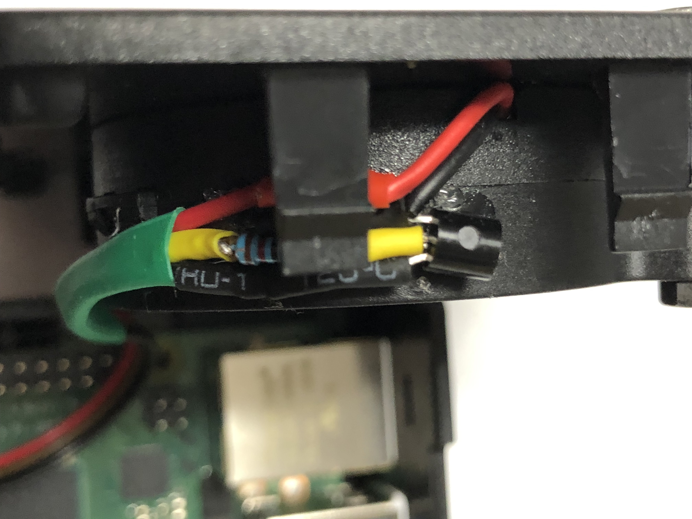

# Raspberry Pi CPU Cooling Systems

How do you cool your Raspberry Pi 4? How can add your own reactive fan to the Raspberry Pi using a transistor?

## Intro
If you are doing anything that is CPU intensive, your Raspberry Pi heats up. 
The Raspberry Pi 3 ran hotter than the models before, and the Raspberry Pi 4 runs even hotter. 
If the CPU were to run too hot for an extended period of time, its lifetime would be reduced and 
it would start having problems running properly. 
When the CPU gets above a certain temperature, the Raspberry Pi will automatically start slowing itself down, 
throttling itself to reduce the load on the CPU. 
This happens progressively; on the Raspberry Pi 4, the first drop goes from 1.5 GHz to 1.0 GHz 
after the temperature reaches about 80°C (175°F). 

If you want your Raspberry Pi to continue running at its maximum speed for longer periods of time, you need to cool the CPU down.

## CPU Cooling Methods
 
The name of the game for cooling is conducting the heat away from the parts that get hot. 
Cooling can be divided into two categories: passive cooling and active cooling. 
If you do absolutely nothing, out of the box your CPU is passively cooled by the airflow.
 
Improving on the airflow passive cooling requires adding some sort of device that improves some aspect, such as:

*	Changing the surface area of the radiating device
*	Moving the air faster
*	Making the air cooler
*	Using something other than air to conduct the heat

On the flip side, putting your Raspberry Pi into an enclosed case may make it look nicer, but will usually make it harder to keep it cool.

## Change the Surface Area
Changing the surface area is usually achieved through using various forms of heatsinks. 
The simplest form are aluminum fins that are attached to the overheated chip using thermally conductive adhesives. 
There are even aluminum cases that act like a very large heat sink. 
The more surface area you have, the better the existing air flow affects the cooling.

## Move the Air Faster
Moving the air faster requires fans. Fans come in many sizes and shapes, 
but they all either blow cooler air onto the CPU or suck the hotter air away from the CPU. 
Another dimension with fans is whether they are reactive or not. 
That is, are they always on? 
Or is there something that reacts to the CPU’s temperature to decide to turn on the fan?
 
## Lower the Air Temperature
Lowering the air temperature requires some form of air conditioning. 
Refrigerated AC systems can be used to reduce the environment’s temperature. 
This isn’t very practical if all you’re cooling is a small system like a Raspberry Pi, 
but if you have air conditioning set up for something else, you may be able to reuse it.

## Liquid Cooling Systems
Liquid cooling systems can also be used to circulate the warmth away from the CPU. 
A “heat pipe” carries a conducting fluid past the CPU. 
These closed systems turn the liquid into a vapor when passing over the heated CPU, 
cycle the vapor into a condenser where it returns to a liquid, and then the cycle repeats endlessly. 
Gravity or pumps are used to move the liquid around. 
These are very common in large computers, and at least one maker has made a heat pipe 
and heatsink combination built for the Raspberry Pi.

Speaking of combinations, you certainly can blend these solutions together to form a better solution. 
For example, fans can be attached to heatsinks.
 
## Improving on the Commercial Solutions

There are various commercial cooling systems on the market now, particularly since the advent of the Raspberry Pi 4. 
However, not all of the solutions work well with other things you might be doing with your Raspberry Pi. 
For example, the Pimoroni FanShim is a nice reactive fan solution that does not get in the way of most hats. 
However, its own documents say that you cannot combine it with heat sinks or anything that uses pin BCM18, 
preventing it from being used with I2S devices.

Many fans just blow the air vertically. 
This works fine until you try putting them into a low profile case, or under a HAT. 
The air then would have nowhere to go. 

Many fans just plug into the 5v pin, which means that they are on constantly. 
Depending on the fan, it may produce noise that you really don’t want to hear all of the time. 
 
So what’s a good maker to do? Modify, modify, modify, and perhaps build your own.

## Some Simple Modifications 

Let’s start with the cases. 
A good variable-speed rotary tool can add slots into a plastic case, giving those vertical-oriented fans somewhere to blow. 
Or you can make other holes larger.

There are also fans that blow sideways. 
Adding a hole on the side of a case might be easier than adding slots on the top.

Don’t forget that for a fan to blow, it must also have an air source. 
Sometimes you may need to add ventilation holes (preferably along the bottom of the case) to let fresh air in.

## Switching (Reactive) Fans

A more involved issue is how to keep a fan from running 24 hours a day. 
If the CPU is already cool, there is absolutely no need for the fan to be running.
 
You might be tempted to plug your 3.3V or 5V fan into one of the GPIO output pins. 
Don’t do this! 
The GPIO pins are 3.3V and have a maximum current limitation of about 16mA, 
and even the small fans are usually rated to draw more power than what is allowed. 
(Typical values are 120 to 300mA.)

Instead, you want to use the GPIO pin as a switch for the fan. 
This can be done by connecting the GPIO pin to a relay or transistor. 
A relay is particularly good if you are using a large or higher voltage fan.

If you have a small 5V fan, you can use a common NPN transistor, such as a 2N2222 or S8050. 
(The current rating should to be higher than what the fan can draw. 
The 2N2222 can handle up to 200mA and the S8050 can handle up to 700mA.) 
Connect its emitter to the fan’s black wire and its collector to ground, 
then connect the base to a 1k resistor that in turn connects to the GPIO pin of your choice. 
Connect the fan’s red wire to the 5V pin on the Raspberry Pi. 
You can then control the fan based on whatever criteria you choose.

## You'll Need

*	Small cooling Fan
(For example, https://www.amazon.com/gp/product/B00EL938E6/)
*	S8050 Transistor 
(For example, https://www.amazon.com/S8050-Silicon-Transistor-Voltage-Current/dp/B015E4DJ90/)

### A side-blowing fan attached to a case cover, controlled by a transistor. 


### Wires are connected to 5V (pin 4), Ground (pin 6), and GPIO 23 (pin 16).
### Note the notch on the side for the fan to blow out.

### Closeup of transistor (S8050) attached to fan using hot glue. Fan red to red connector. Fan black to emitter. Fan base to 1k resistor to yellow/brown wire. Fan collector to black connector. 


## A Simple Reactive Fan Controlling Python Script
If you want your fan to react to the CPU temperature, you need to decide on the criteria for when it should start and stop. 
One possible choice might be to turn on when the CPU temperature goes above 65°C (150°F), 
and continue running until it drops below 55°C (130°F).

You don’t want your starting and stopping numbers to be too close together. 
If they are, your software can go into a hysteresis loop, where you wind up with frequent switching between the on and off states. 
This is undesirable.

You should experiment with the values that give you your best experience, 
balancing keeping your CPU cool versus the noise level versus avoiding the throttling state.

The script takes four arguments: 
1.	How often to check the CPU’s temperature. For example, you might want to check every 5 or 15 seconds.
2.	The temperature at which the fan should be turned on, such as 65 for 65°C (150°F).
3.	The temperature at which the fan should be turned back off, such as 55 for 55°C (130°F).
4.	The GPIO number that is controlling the transistor.

Save runfan.py on your pi somewhere, such as /home/pi/bin/runfan.

Then run the command

```shell
chmod a+x /home/pi/bin/runfan
```

to make it executable.

You can use your favorite editor, such as `nano`, to modify the file /etc/rc.local:

```shell
sudo nano /etc/rc.local
```

Then add a line towards the end of /etc/rc.local to execute runfan every time the system is rebooted. 
Make certain that this comes BEFORE any “exit” statements at the end of that file.

```shell
/home/pi/bin/runfan --delay 15 --on-threshold 65 --off-threshold 55 --gpio 23 --verbose > /tmp/runfan.out &
```

Adjust the arguments depending on your needs, and particularly which GPIO number you are using, 
shown here as number 23 (connected to pin 16). 
This captures a running trace of the time, temperature and fan state in the file /tmp/runfan.out. 
If you do not wish to capture that information, change the invocation line to read:

```shell
/home/pi/bin/runfan --delay 15 --on-threshold 65 --off-threshold 55 --gpio 23 > /dev/null &
```

## In Closing

Overheating is bad for your CPU, and the latest model Raspberry Pi 4 tends to overheat more quickly than previous models. 
Cooling systems can be passive, such as heat sinks or heat pipes, or active, such as fans and air conditioning. 
Some fans run continuously, but needn’t. 

Don’t be afraid to modify any commercial cooling system to fit your needs. 
A few simple tweaks and a small script can make your cooling system the best one around.
